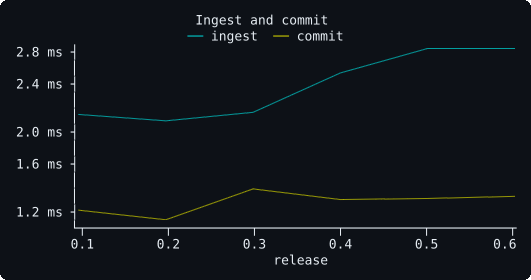
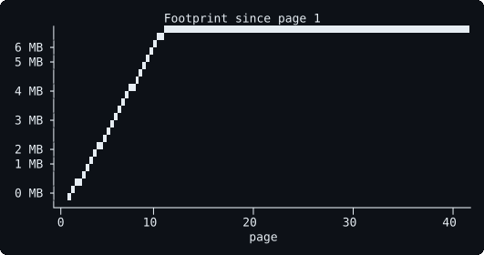
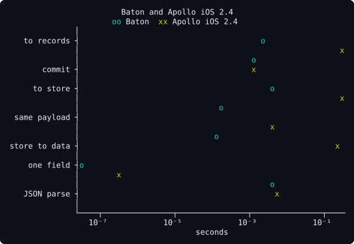

# Benchmarks

Performance here is a measurement, not a speed you can promise on another
machine. Every number comes from `swift run -c release BatonBenchmarks` (or
the comparison package named in its section), recorded with the revision,
machine, OS and date. Append; never edit a past entry.

Figures are those tables drawn again, by [`benchmarks/charts`](benchmarks/charts),
with malevich, the library behind `kaz`. The plot panel is that library's
pixel raster; the axes stay text. `cargo run --manifest-path
benchmarks/charts/Cargo.toml` rewrites the SVG files. A figure does not
replace the table it sits under.

## Across releases

Best ingest and best commit of the fixture at each release below.

<picture>
  <source media="(prefers-color-scheme: dark)" srcset="benchmarks/charts/read-path.svg">
  <source media="(prefers-color-scheme: light)" srcset="benchmarks/charts/read-path-light.svg">
  
</picture>

## Unreleased, the ground step — 2026-10-05

Revision: `2dfae99` with the benches this entry adds, which land in the
commit after it. Machine: Apple M1 Pro (MacBook Pro), macOS 26.5.2, Xcode
26.6, Swift 6.3.3, release build. One run on a quiet machine, so these are
the "before" numbers the plan's spine steps are measured against, not a
record to beat; the entry below took three runs.

No iPhone 12-class device was at hand. The three decision records whose
reopening lines wait for a phone's number say so since this entry.

### Collection, for the lifetime step

| Measurement | Best | Median | Notes |
|---|---|---|---|
| A pass over one root reaching 50,004 records | 2.65 ms | 2.69 ms | marks every record, sweeps none |
| A pass over 301 roots, 50,304 records | 2.68 ms | 2.75 ms | the 300 small roots add 60 µs |
| A pass over 300 roots reaching one record each | 49.3 µs | 52.0 µs | |
| A pass that keeps none of 50,000 records | 21.0 ms | 22.7 ms | a release buffer of zero: what an environment's end will do, above a frame of 16.7 ms |
| 42 pages scrolled, release buffer of 10, the pass | 0.18 ms | 2.53 ms | worst 3.00 ms, as the entry below |

### The re-evaluation a commit runs, for the handle step

The fixture under `@throwOnFieldError`, 899 records, with 20 field errors
landing on the rows' `image`.

| Measurement | Best | Median | Notes |
|---|---|---|---|
| Commit of the errors, no handle retained | 135 µs | 136 µs | |
| The same commit, a `@throwOnFieldError` handle retained | 930 µs | 939 µs | the commit settles the handle's phase: one walk of the selection's field errors |
| The commit that clears them, the handle retained | 713 µs | 716 µs | |
| The verdict: field errors of the operation's own selection, none present | 567 µs | 567 µs | what a derived phase would compute on a read |
| The verdict, 20 errors present | 785 µs | 786 µs | |
| The verdict, in a body's tracking scope | 4.50 ms | 4.56 ms | every slot the walk reads registers |

The handle step's gate proposed a read of the phase under 50 µs on the
largest strict operation in `spec/`. On this one it is 567 µs untracked
and 4.56 ms tracked: the gate fails as proposed, and the step parks at its
first half, the fetch as a value, unless the verdict is made to cost
less than a walk of every record.

### A commit with the report closures set, for the report

| Measurement | Best | Median | Without the closures |
|---|---|---|---|
| The fixture into an empty store, the three report closures set | 625 µs | 633 µs | 648 µs (685) |
| The same payload again, the closures set | 126 µs | 127 µs | 126 µs (130) |

Setting the closures costs a commit nothing: a commit calls none of them.

### The long session, at 50,000 lookups

The bench's session is 50,000 root lookups by id and 500 pages after
cursors, where the entry below's was 2,000.

| Measurement | Best | Median | At 2,000 lookups (the entry below) |
|---|---|---|---|
| Root field with a variable argument, untracked read, at the start | 38.4 ns | 39.2 ns | 36.3 ns (37.0) |
| The same after 50,000 lookups and 500 pages | 54.3 ns | 54.8 ns | 45.4 ns (55.7) after 2,000 |
| A commit of one lookup of a new id, at the session's start and end | 1.83 µs, 2.00 µs | 2.00 µs, 2.21 µs | 1.75 µs, 1.88 µs (1.92, 2.04) |
| A commit of a page of 10, the session's first 50 and last 50 | 20.0 µs, 202 µs | 29.8 µs, 211 µs | 19.6 µs, 196 µs (29.8, 211) |
| 50,000 new characters given a field numbered before the session | 42.6 ms | 48.7 ms | +18.3 MB |
| 50,000 new characters given a field numbered after it | 43.9 ms | 46.1 ms | +34.3 MB |

The session interns keys on `Query` from 469 to 50,672, one per id looked
up, for the life of the process; the root holds 50,202 values, one per
key; and the footprint grows by 22.7 MB over its 61,308 records. The
collector now takes a root's entry with the record it swept, which this
session, retaining everything, never exercises; the table of the process
keeps every key either way until the session-keys step.

## Unreleased at 2ba3d18 — 2026-10-04

Revision: 2ba3d18, the review plan's last changes (#28, #29), before a
release. Machine: Apple M1 Pro (MacBook Pro), macOS 26.5.2, Xcode 26.6,
Swift 6.3.3, release build. Same fixture and image setup as the entry
below. Three runs on a quiet machine; best of the three, median of the
three medians.

### Keys with arguments, and a long session

| Measurement | Best | Median | Notes |
|---|---|---|---|
| 5,000 rows into an empty store, three fields under keys like `labels` | 4.03 ms | 4.10 ms | 356 bytes a row |
| The same, keys like `labels(first: 3)` | 4.02 ms | 4.07 ms | 356 bytes a row: a key the compiler emits as a constant is numbered among its type's dense values |
| The same, keys like `labels(first: $count)` | 4.65 ms | 4.74 ms | 452 bytes a row: a key rendered from a variable is kept in the record's sorted list |
| Root field with a variable argument, untracked read | 30.6 ns | 31.6 ns | 28.1 ns in the entry below, when every key was dense |
| A session's newest root field with an argument, untracked, at its start | 36.3 ns | 37.0 ns | |
| The same after 2,000 lookups and 500 pages | 45.4 ns | 55.7 ns | a search among the root's 2,000-odd keys with arguments |
| A commit of one lookup of a new id, at the session's start and end | 1.75 µs, 1.88 µs | 1.92 µs, 2.04 µs | |
| A commit of a page of 10, the session's first 50 and last 50 | 19.6 µs, 196 µs | 29.8 µs, 211 µs | the merge builds a set and an array of every edge already merged |
| 2,000 new characters given a field numbered before the session | 1.54 ms | 1.55 ms | +0.2 MB |
| 2,000 new characters given a field numbered after it | 1.61 ms | 1.62 ms | +1.0 MB; before keys with variables were kept apart, 5.86 ms and +28.2 MB, measured at that commit |

The session interns keys on `Query` from 169 to 2,372 and on `Character`
from 55 to 556, for the life of the process, and the footprint grows by
20.2 MB over its 13,308 records.

### The paths the entry below measured

| Measurement | Best | Median | The entry below |
|---|---|---|---|
| Response bytes into a change set | 2.88 ms | 3.06 ms | 2.87 ms (2.88) |
| Commit into an empty store, 899 records | 638 µs | 662 µs | 632 µs (653) |
| Commit of the same payload again | 126 µs | 126 µs | 124 µs (125) |
| Untracked read, per field | 25.0 ns | 25.9 ns | 25.0 ns (30.4) |
| Tracked read, a row body of 8 fields, per field | 603 ns | 638 ns | 574 ns (608) |
| Field selected on an interface, untracked | 22.2 ns | 22.3 ns | 22.2 ns (22.3) |
| Spread with `@arguments`, the fragment's lens | 10.2 ns | 10.4 ns | 10.2 ns (10.4) |
| The check of the fixture plan | 109 µs | 110 µs | 107 µs (110) |
| An optimistic `@appendEdge` on 50 edges: apply, revert | 5.79 µs, 4.67 µs | 5.96 µs, 4.79 µs | 5.79 µs, 4.62 µs |
| A commit that deletes one record from 8,965 | 2.13 ms | 2.15 ms | 2.10 ms (2.21) |
| Hydration: the check reads 898 rows | 1.56 ms | 1.68 ms | 1.57 ms (1.59) |
| A launch, open and hydrate at once | 4.01 ms | 4.76 ms | 3.84 ms (4.06) |
| A launch, hydrate after the image opened | 1.78 ms | 1.90 ms | 1.76 ms (1.92) |
| A multipart response of 978 KB, in 16 KB chunks | 482 µs | 491 µs | 483 µs (489) |
| Collection pass over about 9,000 records | 0.18 ms | 2.58 ms | 0.17 ms (2.4) |
| Scroll footprint at page 42 | +4.4 MB | — | +4.3 MB |

What it means: the plan's last changes move the paths a screen takes by no
more than the spread between runs, a few percent, except a read through a
key with a variable, which pays a search: 31.6 ns against 28.1 ns. In
exchange a long session no longer widens every record of a type by the keys
its cursors and ids made. A field first used after 2,000 lookups and 500
pages costs 2,000 records 1.0 MB, where it cost 28.2 MB, and a key with
constant arguments costs what a key without them costs.

## Unreleased at 418ceff — 2026-10-03

Revision: 418ceff, the improvements after 0.6.0, before a release. Machine:
Apple M1 Pro (MacBook Pro), macOS 26.5.2, Xcode 26.6, Swift 6.3.3, release
build. Same fixture, same image setup as 0.6.0. Three runs of each tree,
alternating, the same evening; the 0.6.0 column is the 0.6.0 tree run again
that evening, so the two columns share the day. Best of the three runs,
median of the three medians.

### The paths 0.6.0 measured, same day

| Measurement | 0.6.0 best (median) | This revision best (median) | Notes |
|---|---|---|---|
| Response bytes into a change set | 2.74 ms (2.89) | 2.87 ms (2.88) | the ingest now groups each record's entries off the main actor, one per slot, which the commit used to do |
| Commit into an empty store, 899 records | 1.36 ms (1.42) | 632 µs (653) | |
| Commit of the same payload again | 185 µs (190) | 124 µs (125) | a list that did not change allocates nothing |
| Untracked read, per field | 28.3 ns (28.3) | 25.0 ns (30.4) | one run read 25.0 ns and two 30.4 ns, with nothing else moving between them |
| Tracked read, a row body of 8 fields, per field | 527 ns (569) | 574 ns (608) | exact channels: one key path per slot, built on first use |
| The check of the fixture plan | 105 µs (105) | 107 µs (110) | |
| `@catch` read of a field without an error | 123 ns (127) | 83.1 ns (83.4) | |
| `satisfied` of a lens with one `@required` field | 28.6 ns (29.8) | 20.0 ns (20.2) | |
| `nodes` of 2,100 merged edges, untracked | 123 µs (127) | 84.9 µs (85.3) | one pass, no array of anchors in between |
| `nodes` of 2,100 merged edges, tracked | 1.12 ms (1.24) | 1.16 ms (1.25) | |
| Commit into an empty store with the image on | 1.47 ms (1.50) | 721 µs (746) | |
| Write-behind of that commit, off the main actor | 1.15 ms (1.17) | 1.15 ms (1.16) | |
| Write-behind of one changed record | 45.9 µs (49.7) | 43.2 µs (46.6) | |
| Hydration: the check reads 898 rows | 1.69 ms (1.72) | 1.57 ms (1.59) | |
| The check once the records are in memory | 105 µs (106) | 106 µs (107) | |
| A launch, open and hydrate at once | 3.89 ms (4.24) | 3.84 ms (4.06) | |
| A launch, hydrate after the image opened | 1.76 ms (1.84) | 1.76 ms (1.92) | |
| First use in a process: open, create, a read that misses | 2.74 to 2.77 ms | 2.68 to 2.95 ms | one shot per run; 0.6.0's entry recorded 1.6 to 2.3 ms on its own day |
| Collection pass over about 9,000 records, from 10 roots | 0.20 ms (2.9), worst 3.7 | 0.17 ms (2.4), worst 3.2 | the lifetime bench below |
| Scroll footprint at page 42 | +4.1 to +4.3 MB | +4.3 MB | one run read +0.5 MB, a resident-size reading after the system reclaimed pages |

0.6.0's bench printed the image's file alone, 167,936 bytes; this
revision's prints the file and its write-ahead log together, 4,440,384
bytes, because the log is what the disk holds until a checkpoint.

### New measurements

| Measurement | Best | Median | Notes |
|---|---|---|---|
| Resolve the fixture plan for another page | 676 ns | 678 ns | 8.5 µs before the plan kept its resolutions |
| One field changed, 20 rows observing their name, one commit | 127 µs | 128 µs | one notification; 0.6.0 timed two commits and no observer here (368 µs) |
| A root field with a variable argument, untracked | 28.1 ns | 28.2 ns | 232 ns before keys with variables resolved once per owner |
| The same, tracked, one body per read | 952 ns | 981 ns | |
| A field selected on an interface, untracked | 22.2 ns | 22.3 ns | 56 ns before abstract slots |
| A spread with `@arguments`, the fragment's lens | 10.2 ns | 10.4 ns | 453 ns before, for the read and one variable of the child's scope |
| Apply an optimistic layer, 20 rows observing | 3.00 µs | 3.21 µs | one notification |
| Revert it | 2.21 µs | 2.33 µs | one notification |
| Commit the fixture under the layer | 126 µs | 127 µs | no notification |
| Resolve the layer with the server's answer | 1.21 µs | 1.38 µs | no notification |
| Ingest a 64-byte mutation payload | 2.42 µs | 2.50 µs | 4.5 µs before reservations followed the response's size |
| Commit it into the 899-record store, one field changing | 791 ns | 834 ns | |
| A 69-byte subscription frame, its envelope read | 334 ns | 375 ns | 2.21 µs before the scanner stood apart from the cursor |
| Ingest with 20 field errors | 2.89 ms | 2.89 ms | 20 placed, 20 uncaught |
| Commit the errors, 20 rows observing their image | 151 µs | 151 µs | 20 notifications |
| Commit that clears them | 149 µs | 150 µs | 20 notifications |
| A commit that deletes one record from 8,965 | 2.10 ms | 2.21 ms | the pass that tells every slot linking to it |
| Wakes of a body reading one root field while 64 others are written | 0 | — | |
| `loadNext` with no body on the nodes, per page of 50 | 167 µs | 218 µs | page 2 about 200 µs, page 21 about 200 µs, page 41 230 to 340 µs |
| `loadNext` with a body reading every node, per page of 50 | 185 µs | 556 µs | page 2 185 to 230 µs, page 21 516 to 558 µs, page 41 0.88 to 1.16 ms |
| An optimistic `@appendEdge` on a connection of 50 edges: apply | 5.79 µs | 5.96 µs | |
| Revert it | 4.62 µs | 4.71 µs | |
| A multipart response of 20 parts, 978 KB, parsed in 16 KB chunks | 483 µs | 489 µs | 14.6 ms before the reader scanned whole chunks |
| The same response read through `URLSessionTransport` | 1.10 ms | 1.38 ms | 6.1 ms before the transport read its data task's chunks |

The "before" figures in the notes were measured at the commit that made
the change, on this machine, alternating the two builds; each is in that
commit's message and in the changelog.

What it means: a commit of the fixture costs half of what it did, and a
read through a key with variables, an interface or a spread with arguments
costs what a plain read costs. A tracked read costs about a tenth more,
the price of a channel per slot instead of channels shared by slots.

A correction to 0.4.0, which said a page costs the main actor a merge
"whatever the number of pages already merged". Split by page, with no body
reading the nodes, a page costs about the same at page 21 as at page 2 and
up to two thirds more at page 41: the merge builds a set and an array of
every edge already merged. A body that reads every node pays for reading
them again on every page, which grows with the connection, to about 1 ms
at page 41. The merge is left as it is until a phone shows it in a frame.

## 0.6.0 — 2026-10-03

Revision: the 0.6.0 tree. Machine: Apple M1 Pro (MacBook Pro), macOS 26.5.2,
Xcode 26.6, Swift 6.3.3, release build. Same fixture as 0.1.0. The image is
a SQLite file in the temporary directory of the internal disk, through the
system's SQLite 3.51.0, with the page cache warm.

The earlier numbers, same day as 0.5.0's: ingest 2.76 ms (2.76), commit into
an empty store 1.37 ms (1.35), same payload again 183 µs (187), one field
changed 368 µs (376), untracked read 28.3 ns (29), tracked read 544 ns (536),
check 105 µs (126), the optimistic cycle 413 µs (413), a connection page
285 µs best (320), the scroll footprint +4.4 to +4.7 MB (+4.7). Nothing on
the paths a store without an image takes moved; the check is the 0.3.0
figure again.

### Persistence: the fixture's 898 records and the root, through the image

| Measurement | Best | Median | Notes |
|---|---|---|---|
| Commit into an empty store with the image on (899 records) | 1.49 ms | 1.55 ms | 1.37 ms without: the commit takes a snapshot of each changed record for the writer |
| Write-behind of that commit, off the main actor | 1.16 ms | 1.25 ms | 898 rows encoded and one transaction; the file is 168 KB, against 686 KB of response |
| Write-behind of one changed record | 46 µs | 50 µs | the hop to the writer and back included |
| Hydration: the check reads 898 rows into an empty store | 1.72 ms | 1.78 ms | 1.9 µs a record: a lookup by key, a decode, a fill, inside one read transaction |
| The check once the records are in memory | 105 µs | 106 µs | the image is not consulted |
| Hydration right behind a commit of 899 records | 2.87 ms | 3.00 ms | the read writes the pending batch first, so it never sees less than memory knew |
| First use in a process: open, create the tables, a read that misses | 2.1 ms | — | one shot; 1.6 to 2.3 ms across runs |
| A launch in a new process, the store asked the moment the image's handle exists | 4.68 ms | 5.36 ms | the main actor waits for the open: SQLite's first use, the file, the launch's own bookkeeping, then the 898 rows |
| A launch in a new process, the store asked after the image has opened | 1.78 ms | 1.87 ms | the open ran off the main actor, as it does when an app makes its environment before its first view |

What it means: a screen an earlier launch fetched is in the store 1.8 ms
after its handle asks, with nothing from the network, when the app made its
environment early enough for the file to open on another thread, and under
5 ms when it did not. Hydration costs a third more than committing the same
records from a response (1.72 ms against 1.37 ms): that third is the image.
Keeping the image costs a commit a tenth of a millisecond on the main actor
and a millisecond off it. A read that lands behind a write waits for it,
which is the one place the main actor meets the disk's writer.

The sample, launched twice against the public API: the first launch left 41
rows, one root field and one fetch time in its image; the second read all 41
(their generation moved from 1 to 2) before its refetch landed.

Caveats: a Mac, not a phone, and a warm page cache: flash latency on a cold
launch is not in these numbers, and the roadmap's exit asks for them on an
iPhone 12-class device.

## 0.5.0 — 2026-10-03

Revision: the 0.5.0 tree. Machine: Apple M1 Pro (MacBook Pro), macOS 26.5.2,
Xcode 26.6, Swift 6.3.3, release build. Same fixture as 0.1.0; the error
bench adds an `errors` array naming every row's `image` to it.

The earlier numbers, same day as 0.4.0's: ingest 2.76 ms (2.53), commit into
an empty store 1.35 ms (1.34), same payload again 187 µs (184), one field
changed 376 µs (372), untracked read 29 ns (28.5), tracked read 536 ns (552),
check 126 µs (127), the optimistic cycle 413 µs (414), a connection page
320 µs best (281), the scroll footprint +4.7 MB (+4.2 to +5.0). The ingest
moved by a quarter of a millisecond: every field record now carries the
deferred label and the caught flag, and the response's top level is read
through a general member walk instead of two byte compares. The rest is
within the day's noise.

### Errors: the fixture with a field error on every row's image

| Measurement | Best | Median | Notes |
|---|---|---|---|
| Ingest of the fixture with 20 field errors | 3.00 ms | 3.10 ms | 2.76 ms without; the difference is the index of entries the path walk needs, built only when errors exist |
| Commit the errors, then clear them, 20 rows observed (two commits) | 409 µs | 417 µs | each errored slot notifies once when the error lands and once when it clears |
| `@catch` read of a field without an error, per field | 122 ns | 122 ns | a `Result`, a closure and the error lookup, against 29 ns for a plain read |
| `satisfied` check of a lens with one `@required` field, per lens | 29 ns | 29 ns | one tracked read |

What it means: a response without errors pays nothing for the machinery; one
with errors pays a path walk per error; a view that opts into `@catch` pays
a hundred nanoseconds per field it catches, and a `@required` lens costs a
read per required field at the boundary that produces it.

## 0.4.0 — 2026-10-03

Revision: the 0.4.0 tree. Machine: Apple M1 Pro (MacBook Pro), macOS 26.5.2,
Xcode 26.6, Swift 6.3.3, release build. Same fixture as 0.1.0; the connection
bench uses the test schema's `notes` connection on a character, with 42
synthetic pages of 50 notes.

The earlier numbers, same code paths, same day: ingest 2.53 ms (2.16 in
0.3.0), commit into an empty store 1.34 ms (1.44), same payload again 184 µs
(164), one field changed 372 µs (331), untracked read 28.5 ns (26), tracked
read 552 ns (542), availability check 127 µs (104), a layer applied and
reverted 43 µs (41), the full optimistic cycle 414 µs (375). The untracked
read moved on unchanged code, so part of the drift is the day; the rest is
real and small: every field record now carries a handle reference and every
linked field a connection reference, the ingest keeps a second scratch list
per object for the connection links, and the check skips deleted records.
Two larger regressions were found by this bench and fixed before the tag: an
inline `ConnectionSlots` in the resolved field had the ingest copying 250
bytes per matched key and the check at 231 µs; and records pre-sized to their
type's slot count cost the scroll bench 1 KB per record once a paginated field
had registered a key per page on `Character` (+15.8 MB).

### Connections: 42 pages of 50 notes merged into one connection

| Measurement | Best | Median | Notes |
|---|---|---|---|
| `loadNext`: recorded transport, ingest off the main actor, merge, per page of 50 edges and nodes | 281 µs | 734 µs | 41 pages, 2,100 nodes, 41 notifications: one per page, on the connection's `edges` slot |
| `nodes` of the merged connection, 2,100 lenses, untracked | 124 µs | 125 µs | 59 ns per node |
| `nodes` of the merged connection, inside an observation scope | 1.11 ms | 1.48 ms | one registrar access per edge and per node |
| Collection after the 41 pagination fetches (no roots of their own) | — | — | 4,289 records before, 4,207 after: the 41 page records and their page infos go, every edge and node stays |
| Refetch of the first page while 42 are merged | — | — | 50 nodes, one notification |

What it means: a page costs the main actor a merge of two edge lists and one
notification, whatever the number of pages already merged; reading two
thousand nodes untracked is a tenth of a millisecond; and pagination fetches
leave nothing behind but the data, because the connection, not the page, is
what roots reach.

### Lifetime: 42 pages scrolled through a release buffer of 10, again

Same bench as 0.2.0. Records plateau at 8,982 with 10 roots from page 10 on,
as before; the footprint since page 1 plateaus between +4.2 MB and +5.0 MB
across three runs (0.2.0: +6.5 MB), because records now size their values by
the slots they receive rather than by the type's slot count. Collection pass:
best 0.24 ms, median 3.8 ms, worst 4.6 ms.

## 0.3.0 — 2026-10-03

Revision: the 0.3.0 tree. Machine: Apple M1 Pro (MacBook Pro), macOS 26.5.2,
Xcode 26.6, Swift 6.3.3, release build. Same fixture as 0.1.0; the writes use
the test schema's `rename` mutation on top of it.

The read-side numbers hold: ingest 2.16 ms, same payload again 164 µs, one
field changed 331 µs, untracked read 26 ns, tracked read 542 ns, availability
check 104 µs (115 µs in 0.1.0; the check no longer copies plan fields). The
commit into an empty store is 1.44 ms against 1.24 ms: every changed slot now
also lands in an undo log, which is what lets a layer rebase.

### Writes: optimistic layers, one renamed character, 20 rows observed

| Measurement | Best | Median | Notifications |
|---|---|---|---|
| Apply a layer (one field on one record) and revert it | 41 µs | 48 µs | 2: one at the apply, one at the revert |
| Apply, commit the whole fixture under the layer, resolve with the server's answer, restore | 375 µs | 394 µs | apply 1, rebase 0, resolve 0, restore 1 |

What it means: an optimistic response costs microseconds and exactly the
notifications its visible change deserves. A server payload of 899 records
arriving while a layer is live costs the rebase about 200 µs more than a
plain commit (lift the layer, apply, re-apply) and notifies nothing, because
nothing visible changed; the answer that resolves the layer notifies nothing
either, because it agrees with the layer. The row observes a change twice in
the cycle: when the layer appears and when the restore commit changes the
name back.

GitHub's schema (1,558,210 bytes, about 1,800 definitions) builds in Relay's
front end in 33 ms; the GitHub sample's six documents compile in 35 ms.

## 0.2.0 — 2026-10-02

Revision: the 0.2.0 tree. Machine: Apple M1 Pro (MacBook Pro), macOS 26.5.2,
Xcode 26.6, Swift 6.3.3, release build. Same fixture as 0.1.0.

The 0.1.0 measurements are unchanged within noise (ingest 2.08 ms, commit
1.15 ms, same payload 164 µs, untracked read 26 ns, tracked read 524 ns,
check 114 µs).

### Lifetime: 42 pages scrolled through a release buffer of 10

Each page is the fixture with every id shifted, so pages share no records;
each page's handle is retained, settled, released, and a collection runs.

| Page | Records in store | Roots | Footprint since page 1 |
|---|---|---|---|
| 1 | 899 | 1 | +0.0 MB |
| 5 | 4,491 | 5 | +2.5 MB |
| 10 | 8,981 | 10 | +5.8 MB |
| 11 | 8,981 | 10 | +6.4 MB |
| 20 | 8,981 | 10 | +6.5 MB |
| 30 | 8,981 | 10 | +6.5 MB |
| 42 | 8,981 | 10 | +6.5 MB |

<picture>
  <source media="(prefers-color-scheme: dark)" srcset="benchmarks/charts/footprint.svg">
  <source media="(prefers-color-scheme: light)" srcset="benchmarks/charts/footprint-light.svg">
  
</picture>

Collection pass over about 9,000 records (mark from 10 roots, sweep about
900): best 0.30 ms, median 3.8 ms, worst 5.0 ms, on the main actor. The
median is dominated by the sweep's dictionary removals and record clearing;
an off-main mark and a budgeted sweep are on the watch list, with this number
as the trigger if it grows past a frame on a phone.

What it means: memory is bounded by the buffer, not by how far the user
scrolls, and nothing a mounted or recently left screen can reach is ever
collected.

## 0.1.0 — 2026-10-02

Revision: the 0.1.0 tree. Machine: Apple M1 Pro (MacBook Pro), macOS 26.5.2,
Xcode 26.6, Swift 6.3.3, release build. Fixture: the recorded response in
`spec/rickandmorty/characters-page-1.json`, 686,254 bytes, about 6,500 JSON
objects that normalize into 899 records (20 characters, 51 episodes, 826
characters referenced from episode casts).

### Baton

| Measurement | Best | Median |
|---|---|---|
| Ingest: response bytes → change set | 2.14 ms | 2.55 ms |
| Commit into an empty store (899 records) | 1.24 ms | 1.32 ms |
| Commit the same payload again (nothing changes, no allocation for strings) | 165 µs | 165 µs |
| Commit with one field changed, 20 rows observed (base commit + edited commit) | 332 µs | 334 µs |
| Untracked lens read, per field | 26 ns | 26 ns |
| Tracked read inside an observation scope, one row body of 8 fields, per field | 553 ns | 568 ns |
| Availability check of the whole fixture plan against the store | 115 µs | 116 µs |

What they mean: a 686 KB response is in the store 3.4 ms after the bytes
arrive, on one background actor plus one main-actor commit; a refetch that
changes nothing costs the main actor 165 µs and no view; a refetch that
changes one field invalidates one row. The tracked-read cost is
Observation's own and matches an `@Observable` property (spike, 2026-10-02:
534 ns against 554 ns).

Generated code for the sample's four screens: 47 field accessors at an
average of 107 bytes of source per accessor line (budget 120); 27.8 KB in
total including operation text, plans and the shared slots file. For the
fixture document alone: 14.5 KB (Baton) against 15.3 KB (Apollo iOS 2.4
codegen for the same document and schema).

### Apollo iOS 2.4.0, same operation, same graph

Measured with `benchmarks/apollo-comparison` (`swift run -c release
ApolloComparison`), same machine and day. The response was recorded for
Apollo's own query text, which adds `__typename` to every object because its
normalizer keys on it: 849,101 bytes against Baton's 686,254 for the same
data. Apollo's schema configuration keys entities by `id`, as Baton does; both
produce 899 records. Apollo's parse includes `JSONSerialization`, as its own
interceptor does, and builds the typed models and the cache records in one
pass with `includeCacheRecords: true`.

| Step | Baton | Apollo iOS 2.4 | Ratio |
|---|---|---|---|
| Response bytes → normalized change set / records | 2.14 ms | 317 ms (`JSONResponseParser`, models + records) | 148× |
| Commit / publish into an empty store | 1.24 ms | 1.39 ms (`InMemoryNormalizedCache`) | 1.1× |
| Bytes → data in the store, total | 3.4 ms | 318 ms | 94× |
| Same payload again, nothing changes | 165 µs | 3.99 ms (`publish`) | 24× |
| From the store to readable data | 0 (lenses read slots) + 115 µs availability check | 228 ms (`store.load`, whole query re-executed into models) | — |
| One field read, per field | 26 ns (lens, untracked) | 296 ns (`DataDict` access, after `load`) | 11× |
| `JSONSerialization` alone, for scale | 4.47 ms (686 KB) | 5.73 ms (849 KB) | — |

<picture>
  <source media="(prefers-color-scheme: dark)" srcset="benchmarks/charts/apollo.svg">
  <source media="(prefers-color-scheme: light)" srcset="benchmarks/charts/apollo-light.svg">
  
</picture>

The figure is that table, in seconds, on a log axis. Baton's store-to-data
mark is the availability check; the one-field mark is the untracked lens
read.

The ratios are not the point; the shape is. Apollo pays for materialization
twice, once building models and records from the tree and once rebuilding
models from the cache, and neither pass is cheaper than a frame; Baton
materializes nothing a view did not read. The 317 ms is consistent with
the maintainers' own issue tracker (about 6 ms of JSON decoding against
159 ms of type mapping for an 874 KB response, apollo-ios#3600, 2024), and
Apollo's cache publish is as fast as Baton's commit: the store is not where
the time goes.

Caveats: a Mac, not a phone; one fixture; Apollo's release build, default
options, no SQLite; Apollo's response is 24% larger by construction. The
comparison package is in the repository so anyone can rerun or correct it.

Commands:

```bash
swift run -c release BatonBenchmarks
cd benchmarks/apollo-comparison && swift run -c release ApolloComparison
```
